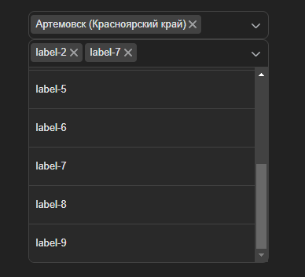

# Test Assignment for Interview

This project was created as part of a technical interview assignment. The goal was to demonstrate proficiency in frontend development, specifically with **React.js**, **TypeScript**, and **CSS Modules**. The task was completed on **February 9, 2023**.

---

## 📄 Assignment Details

The requirements were as follows:

- Fetch and display data from `api.hh.ru`.
- It is necessary to completely copy the (Pixel Perfect ) component from VKontakte.
- Add a multi-selection.
- Use the specified technology stack: **React.js**, **TypeScript**, and **CSS Modules**.

---

## 🚀 Project Setup

### Prerequisites

Ensure you have the following installed:

- Node.js >= 20.17.0
- `npm`

### Installation and Local Run

1. Clone the repository:

   ```bash
   git clone https://github.com/dmaximyuk/dropdown
   cd dropdown
   ```

2. Install dependencies:

   ```bash
   npm i
   ```

3. Start the development server:

   ```bash
   npm run dev
   ```

4. Open the application in your browser at:
   ```
   http://localhost:3000
   ```

---

## 🛠️ Technology Stack

This project utilizes:

- **React.js** : For building the user interface.
- **TypeScript**: To ensure type safety and better developer experience.
- **CSS Modules**: A CSS Modules for structured and maintainable styles.

---

## 📂 Project Structure

```plaintext
src/
├── libs/          # Helpers for project
└── components/    # Components
  └── ui/          # Reusable components assembled from style-guides
```

---

## 🖋️ Functionality

Implemented features:

1. **Data Display**:

   - Fetched data from an API and displayed it in a clean, structured format.

2. **Dropdown**:
   - Drop-down **list** of **cities**.
   - Choosing **one** or **more** cities.

---

## 📸 Screenshots

### Main Screen



---

## 🙎️ Contact

If you have any questions, feel free to reach out:

- **Email**: d_maksimyk@vk.com
- **Telegram**: https://t.me/d_maximyuk
- **GitHub**: https://github.com/dmaximyuk

---

> **Note**: This test assignment was created solely for demonstration purposes and is not intended for commercial use.
